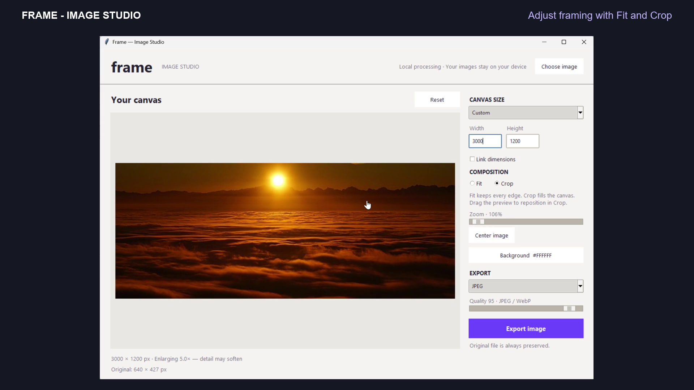

# Frame — Image Studio

An English-language Python desktop application for preparing images for web and e-commerce. A large live canvas and a compact settings panel make framing visible before export.

## Demo

[](Frame-Image-Studio-Demo.mp4)

**[Watch the 24-second demo](Frame-Image-Studio-Demo.mp4)** — resizing, Fit/Crop framing and JPEG export on Windows.

## Quick start · Windows

1. Download `frame-image-studio.zip` from this repository’s **Releases** section and extract it to a new folder. Alternatively, use **Code → Download ZIP**.
2. Install Python 3.11 or newer from https://www.python.org/downloads/windows/ if needed, including the Python Launcher and Tcl/Tk support.
3. Double-click **start.bat**. First launch downloads Pillow into a project-local virtual environment. Later launches work offline.
4. Click **Choose image** or the empty canvas.
5. Select a preset or enter Width and Height.
6. Choose **Fit** to retain all edges, or **Crop** to fill the output canvas. Use Zoom to enlarge the image; moving the slider automatically selects Crop. Drag the preview to adjust framing. Selecting Fit resets zoom to 100% and shows the whole image.
7. Choose a background color, format and quality, then **Export image**.

## Features

- Square, Portrait, Story, Landscape, Original and Custom dimensions.
- Linked dimension fields, optional; no stretching in either composition mode.
- Live preview with crop positioning and 1–3× zoom with automatic Crop selection and a percentage indicator.
- Background color selection for padding and JPEG transparency flattening.
- JPEG, PNG and WebP export. Quality slider affects JPEG/WebP; PNG is lossless.
- Reset settings, center framing and enlargement warnings.
- Source-file overwrite protection, EXIF orientation correction and ICC profile retention.
- Local photo processing. No accounts, uploads or API keys.

## Notes

This desktop prototype does not include browser hosting, drag-and-drop file loading, batch processing or undo history. Reset restores the default settings.

The preview is scaled for display and is not a pixel-level or color-proofing view. Export uses the original resolution and the same framing settings. PNG/WebP alpha is preserved; preview displays transparency against white. JPEG flattens it against the selected background. Native file dialogs may use your operating-system language.

Upscaling cannot recover missing detail. Animated inputs export a single frame. EXIF metadata is not copied; the original ICC profile is retained. Maximum output is 10000 pixels per dimension and 40 megapixels in total.

## Manual setup

```bat
py -3 -m venv .venv
.venv\Scripts\python -m pip install -r requirements.txt
.venv\Scripts\python app.py
```

On macOS/Linux use `python3 -m venv .venv` and `.venv/bin/python` instead. Linux may require its separate Tkinter package.

## About this project

Created by Pinar Unal as a practical desktop tool for preparing product and e-commerce images. Developed with AI assistance and refined through hands-on testing.

## Feedback

Use this repository’s Issues tab to report bugs or suggest improvements. Include your operating system, Python version, steps to reproduce the problem and the error message. Do not share private customer images or credentials.

## License

No open-source license has been granted for this project. Contact the repository owner before redistribution or reuse beyond rights granted by GitHub’s terms.

## Validation

Checked Python syntax, proportional fitting, custom padding color, crop positioning and zoom, shared preview/export composition, all three output formats and source protection. Windows manual walkthrough completed on September 19, 2026: launcher startup, opening an image, changing dimensions, Fit/Crop framing and JPEG export. The saved JPEG was opened to confirm the result. See the demo above.
